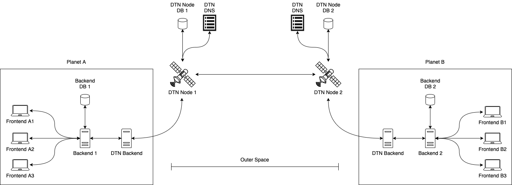

# [Deprecated]

## Reat this first, please.

This backend will no longer be used, or updated.

It has been replaced for this new idea: https://github.com/octaviotastico/delay-tolerant-mongoose


The idea behind this DTN-Backend was that you could connect your app backend to this backend in order to make it "delay tolerant proof".

But I changed that idea to simply create a database wrapper, such that when you update that database, those changes would be reflected in other non-local instances, distributed through a DTN network.

That idea would make it easier for you to make your application delay tolerant proof, without any work of opening sockets, or configuration to connecting it to this "DTN-Backend", or any of that stuff...

The only thing you would need to do is: instead of installing mongoose by:

> `npm i mongoose`

or

> `yarn add mongoose`

What you would do instead, is to install "delay-tolerant-mongoose", by doing:

> `npm i delay-tolerant-mongoose`

or

> `yarn add delay-tolerant-mongoose`

And it will be used exactly the same, but instead of doing `Model.save(document)`, you will do `Model.dtSave(document)`, and that's all :)

## Old readme:

# DTN-Backend

## About

This repo will be used to host code for my thesis.

Delay Tolerant Networks (DTNs) are necessary for challenging environments. <br />
Humanity is going to space :) and we need to communicate with people from other planets. <br />
We will do that, with Delay Tolerant Applications.

To do that, I'm experimenting creating a Content Management System (CMS), that will synchronize it's database among all plannets that the DTN connects with, letting people from different planets interact with each other making video conferences, videocalls, sending messages, creating articles, etc.

In a nutshell, this project is part of a Delay Tolerant CMS (which has no name yet xD). <br/>
And the other repos of this same projects are:

- [CMS Frontend](https://github.com/octaviotastico/CMS-Frontend)
- [CMS Backend](https://github.com/octaviotastico/CMS-Backend)
- [µD3TN (protocol)](https://gitlab.com/d3tn/ud3tn)

In order to keep the code more organized, and to make it easier for future applications to be delay tolerant, I splitted the backend of the CMS into two different parts: <br />
**The CMS Backend**: The application's own backend, with it's endpoint bla bla bla but most importantly, the local database. <br />
**The DTN Backend**: A Backend for sending and receiving data over the DTN in order to update local and non-local databases. <br />

You can easily picture that idea with this image:



The frontends A1, A2, A3, ..., AN will use it's own backend (Backend 1). But every time they post/edit/delete something from teir local database, then the Backend 1 will tell DTN Backend to propagate that message all over the network, so Backend 2, ..., Backend N of the CMS will have that updated info too.

## How to test

### Term 1: CMS Back 1
```
yarn start --http-port 2424 --tcp-port 2525 --dtn-port 7474
```

### Term 2: DTN Back 1
```
yarn start --tcp-port 7474 --cms-port 2525 --dtn-port 4242
```

### Term 3: CMS Back 2
```
yarn start --http-port 2626 --tcp-port 2727 --dtn-port 7575
```

### Term 4: DTN Back 2
```
yarn start --tcp-port 7575 --cms-port 2727 --dtn-port 4243
```
